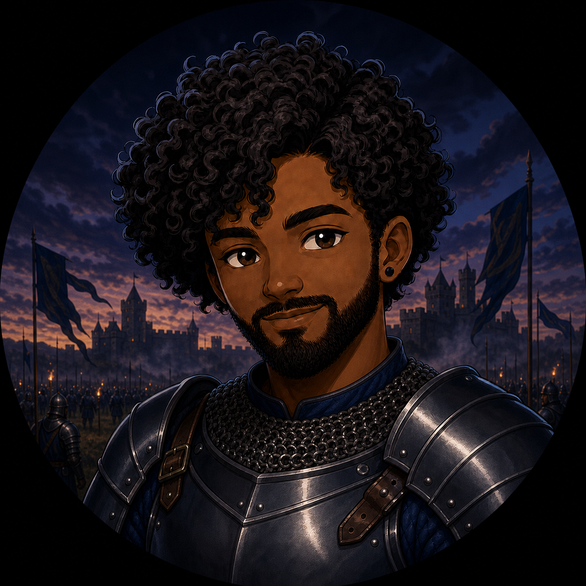

  

  # ⚔️ Mel of NYC 🛡️

  **Hobby Coder · Game Modder · Medieval-Era Enthusiast**

  *Forging mods, scripts, small games, and useful tools—one commit at a time.*

━━━━━━ ⚔️ ━━━━━━

## 📜 The Chronicle

Greetings, traveler—I'm **Mel**, a hobby coder and game modder from NYC. I enjoy taking software and games apart, learning how the pieces work, and forging them into something new.

My interests stretch from game mods and automation scripts to web servers, home-lab projects, and experiments in Godot. I'm also a huge fan of medieval history and bring a little of that atmosphere into the things I create.

## 🏹 Current Quests

- 🎮 Crafting game mods, scripts, and quality-of-life improvements
- 🕹️ Exploring game development with Godot Engine
- ⚙️ Automating repetitive tasks with Python and PowerShell
- 🏰 Running self-hosted services and Raspberry Pi projects
- 🤝 Seeking work, collaborations, and interesting open-source quests

## ⚒️ The Armory

| Guild | Tools of the Trade |
| --- | --- |
| **Languages** | `C` · `C#` · `C++` · `JavaScript` · `Lua` · `PowerShell` · `Python` · `HTML5` · `CSS3` · `PHP` · `Perl` |
| **Gamecraft & Modding** | `.NET` · `Godot Engine` · `Steam` · `Tampermonkey` |
| **Web Stronghold** | `Nginx` · `Apache HTTP Server` · `Apache Tomcat` · `MySQL` · `SQLite` |
| **Workshop & Systems** | `Windows Terminal` · `CMake` · `FFmpeg` · `GIMP` · `Pi-hole` · `Raspberry Pi` |

## 🏰 What I Enjoy Building

- Mods that make games more fun, flexible, or convenient
- Small tools that solve real everyday problems
- Automation that saves time and removes repetitive work
- Experiments that teach me a new language, engine, or system

## 🕯️ Join the Guild

I'm open to work and always interested in clever mods, useful scripts, indie-game ideas, and practical open-source projects. Explore the repositories as this chronicle grows—and feel free to follow along.

━━━━━━ 🛡️ ⚔️ 🛡️ ━━━━━━

<em>Keep learning. Keep building. Keep forging.</em>

